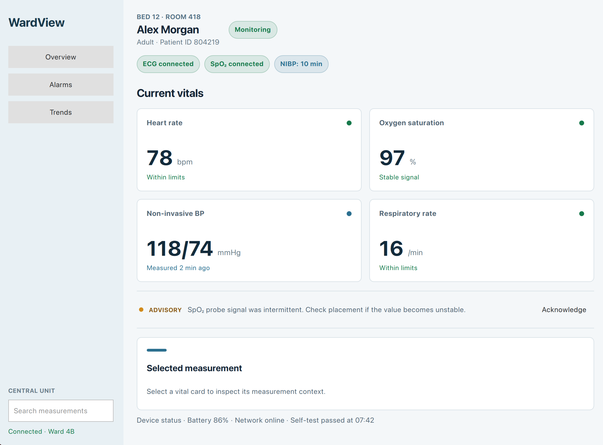

# WardView

Hospital monitors have one job: make the important information obvious, fast.

WardView is a Qt Quick interface for a bedside patient monitor. It brings current vital signs, sensor connections, advisories, and device status into one focused view that remains readable as the display size changes.



## What it does

- Shows heart rate, oxygen saturation, blood pressure, and respiratory rate
- Tracks which measurement is currently selected
- Surfaces sensor advisories without overwhelming the screen
- Switches from a sidebar to compact top navigation when the window is narrower than 820 pixels
- Keeps control state intact while the responsive layout changes

## Why Qt

WardView is designed for software running directly on a medical device, not as a web dashboard placed inside a desktop shell. Qt gives the interface a natural path from a responsive QML prototype to a native device application.

## Built with

- Qt 6.11.1
- Qt Quick and Qt Quick Controls
- QML components, layouts, signals, and `LayoutItemProxy`
- C++17 and CMake

## Run locally

```bash
cmake -S . -B build -DCMAKE_PREFIX_PATH=/path/to/Qt/6.11.1/platform
cmake --build build
```
